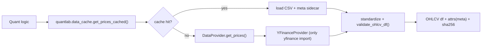
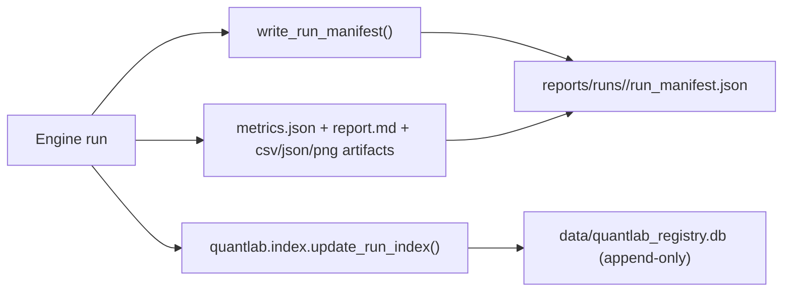
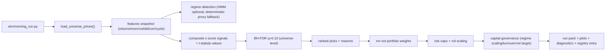

# QUANT_LAB Current State Assessment (2026-02-17)

## Executive Summary
QUANT_LAB is a research-only, paper-only quant research workspace with:
- Deterministic “run packs”: every engine run writes reproducible artifacts under `reports/runs/<run_id>/` with data/config/code hashes.
- Provider-abstracted data access with caching, provenance sidecars, and fail-fast integrity validation.
- Multiple strategy entrypoints (backtests + Morning Signal Engine + Ensemble engine) with walk-forward OOS evaluation and multiple-testing control (BH-FDR).
- A SQLite registry (`data/quantlab_registry.db`) that appends run summaries + diagnostics and blocks UPDATE/DELETE at the database layer.
- A growing rigor toolbox (HAC, bootstrap CI, deflated Sharpe probability, PBO, shrinkage covariance, factor premia, rank-IC/IC decay, OU half-life, EWMA vol).

What is not yet “ambient intelligence”:
- No daily orchestration mode (`quant_preflight.py --daily-suite` is not implemented yet).
- Drift detection is implemented and logged, but not consistently standardized across all engines and not yet used to automatically scale allocations globally.
- Model promotion states exist as diagnostics in the registry, but are not yet used to gate “production-like” allocation behavior.
- Strict mode exists in some runners, but is not yet exposed centrally in preflight and is not enforced uniformly.

## Architecture Overview

### Core Directories
- `quantlab/`
  - **Data layer**
    - `quantlab/data/providers/base.py`: `DataProvider` interface, `DataIntegrityError`, OHLCV standardization + validation.
    - `quantlab/data/providers/yfinance_provider.py`: the only place where `yfinance` is imported.
    - `quantlab/data/providers/polygon_provider.py`: stub placeholder (not implemented).
    - `quantlab/data/calendar.py`: NYSE-like trading day calendar helpers used for strict calendar validation.
    - `quantlab/data_cache.py`: deterministic cache files in `data/cache/` + `.meta.json` provenance sidecars + sha256; provider-injected.
  - **Research engines + helpers**
    - `quantlab/morning/*`: Morning Signal Engine modules (universe, features, regime, signals, portfolio, risk, reporting).
    - `quantlab/stats.py`: performance metrics + BH-FDR + mean-return t-stat.
    - `quantlab/walkforward.py`: walk-forward optimization, OOS stitching, FDR-aware parameter selection.
    - `quantlab/rigor/*`: advanced validation math (HAC, bootstrap CI, DSR, PBO, shrinkage, factor model, IC, OU, EWMA vol, bandit).
    - `quantlab/monitoring/drift.py`: deterministic drift detection suite (KS shift, IC decay, Sharpe breakdown, vol regime change).
    - `quantlab/governance/capital.py`: paper-only capital governance (regime scaling, vol targeting, turnover cap, weight caps).
  - **Run packs + hashing**
    - `quantlab/reporting/run_manifest.py`: run ID, manifest writing, dependency snapshot, composite code hashing.
    - `quantlab/utils/hashing.py`: stable sha256 for bytes/json + composite code hashing.
  - **Registry**
    - `quantlab/registry/db.py`: SQLite schema + append-only triggers.
    - `quantlab/registry/writer.py`: inserts run summaries + diagnostics + promotion state.
    - `quantlab/registry/promotion.py`: deterministic promotion rules (experimental/candidate/production).
  - **Index shim**
    - `quantlab/index.py`: primary registry write; legacy `reports/runs/index.csv` is optional via `QUANTLAB_LEGACY_INDEX_CSV=1`.

- `backtests/`
  - `backtests/ma_crossover.py`: MA crossover with single / robustness grid / walk-forward OOS; benchmark; audit logs; strict option.
  - `backtests/ou_mean_reversion.py`: OU-inspired mean reversion; walk-forward OOS; rigor pack; strict option.
  - `backtests/momentum_accel.py`: momentum acceleration; walk-forward OOS; rigor pack; strict option.

- `sim/`
  - `sim/morning_run.py`: Morning Signal Engine CLI; writes a run pack; includes factor/IC/ou/optimizer diagnostics; governance; drift report; strict option.
  - `sim/ensemble_run.py`: multi-strategy walk-forward + UCB1 ensemble weighting + PBO; writes a run pack; strict option.
  - `sim/replay_game.py`: offline-first paper replay game (interactive/paper-only).

- `ui/`
  - `ui/cockpit.py`: CustomTkinter “Quant Cockpit” that runs Morning Plan and starts paper live/replay simulation (paper-only).

- `quant_preflight.py`
  - End-to-end validation: env check, `pytest -q`, Morning Plan dry run, artifact validation, registry insert, rollback on failure.

### Core Pipelines

#### 1) Data Access (Provider + Cache + Integrity)

Integrity checks (fail-fast):
- duplicate timestamps, non-monotonic index
- missing columns, NaNs, non-finite values
- `High < Low`, `Close` outside `[Low, High]`, negative volume
- unexpected large gaps for daily data; optional strict calendar check against NYSE-like trading days

#### 2) Run Pack Creation (Determinism)

The manifest records:
- `config_hash` (stable JSON)
- `code_hash` + `composite_code_hash` (sorted file list)
- `data_sha256` + `data_provenance` (per-symbol file sha + provider + retrieval timestamps)
- Python + dependency snapshot

#### 3) Morning Signal Engine (Research Plan Generation)

#### 4) Backtests (Strategy Research)
Common properties across strategies:
- Next-bar execution to avoid look-ahead.
- Buy-and-hold benchmark comparison.
- Expanded metrics: total return, CAGR, annualized vol, Sharpe/Sortino (annualized), max drawdown, Calmar, hit rate.
- Statistical screening: t-stats/p-values; BH-FDR for parameter grids and walk-forward selection.

## Implemented Capabilities (What Works Today)

### Deterministic Reproducibility
- Deterministic run IDs + run packs with code/config/data hashes.
- Cache filenames are deterministic by `(symbol, interval, start, end)`; sha256 hashes are computed on raw file bytes.
- Cache sidecar `.meta.json` persists provenance; on cache hit the system does not infer provider version from the environment.

### Data Provenance + Integrity Hardening
- Provider abstraction (`DataProvider`) and a strict “no yfinance imports outside provider” rule.
- Fail-fast OHLCV validation with explicit error messages (`DataIntegrityError`).
- Optional strict calendar validation (NYSE-like business days; intentionally fail-loud in `--strict`).

### Scientific Validation / Rigor
Available math modules under `quantlab/rigor/`:
- Factor regression (Fama–MacBeth style) + residual alpha extraction.
- Rank IC + rolling IC decay.
- OU half-life estimation.
- EWMA volatility modeling (GARCH placeholder).
- Ledoit–Wolf shrinkage covariance.
- Mean-variance constrained optimizer + risk parity allocation.
- Deflated Sharpe probability.
- Block bootstrap confidence intervals.
- Newey–West HAC standard errors and t-stats.
- Probability of Backtest Overfitting (PBO).
- Deterministic multi-armed bandit ensemble weighting (UCB1).
- Drift metrics (PSI/Wasserstein/mean-shift-z) and monitoring drift report (KS/IC/Sharpe/vol-regime suite).

### Research Ops Registry
- SQLite registry at `data/quantlab_registry.db` with tables:
  - `runs`
  - `diagnostics`
  - `ensemble_weights`
- Append-only enforced via DB triggers (UPDATE/DELETE aborted).
- Model promotion logic is recorded as diagnostics (`model_state`).

### Validation + Testing
- `quant_preflight.py` validates:
  - deps present
  - `pytest -q` passes
  - Morning Plan run pack produced and artifacts are sane
  - provider metadata is logged in manifest
  - registry entry exists after validation
  - rollback of run dirs/cache files on failure (registry writes are disabled during the subprocess run and inserted only after validation)
- Current tests: `pytest -q` is green (43 tests).

## Current Limitations / Gaps (Toward “Ambient Intelligence”)

### Orchestration and Experiment Tracking
- `quant_preflight.py --daily-suite` is **not implemented**:
  - no “run all engines daily” orchestration
  - no daily summary in `reports/daily/YYYY-MM-DD_summary.md`

### Drift Detection Standardization
- Drift monitoring exists and is written for Morning Plan (`drift_report.json`) and MA crossover.
- Other engines still primarily log older-style drift metrics; not all runs record a standardized `monitoring.drift` block.

### Governance Coverage
- Capital governance is applied in Morning Plan only.
- No global governance that caps allocation per strategy across the full suite (ensemble + multiple engines), and no consolidated turnover governance across engines.

### Promotion Workflow (Rules Exist, Usage Is Thin)
- Promotion states are computed and logged (experimental/candidate/production), but:
  - not yet surfaced in daily reports (none exist)
  - not yet used to automatically gate allocations (paper-only) in ensemble construction

### Strict Mode Integration
- `--strict` exists in some runners, but:
  - not exposed centrally in preflight
  - not used to enforce suite-wide “hard mode” criteria

### Environment Locking
- Manifests record dependency versions, but the project does not yet enforce a lockfile (reproducibility depends on the local environment).

## Recommendations (Next Steps)

### 1) Implement Daily Research Suite (`quant_preflight.py --daily-suite`)
Implement an orchestration mode that:
1. Runs Morning Plan
2. Runs all walk-forward strategies (MA / OU MR / Momentum Accel)
3. Runs `sim/ensemble_run.py`
4. Validates artifacts (no NaNs, weights sum ~1, provenance present)
5. Computes standardized drift reports
6. Writes registry entries only after full validation
7. Writes `reports/daily/YYYY-MM-DD_summary.md` (regime, top picks, ensemble weights, OOS metrics, drift warnings, governance actions)

### 2) Standardize Drift Reporting Across Engines
Adopt `quantlab.monitoring.compute_drift_report()` output as the canonical `metrics["monitoring"]["drift"]` block in:
- all backtests
- ensemble runs
- morning runs (already present)
Then update registry drift extraction to use this canonical block (partially done).

### 3) Expand Governance Into a Global Suite Layer (Paper-Only)
Add a governance step before final `allocation.csv` is written:
- max allocation per strategy (suite-level)
- max total daily turnover (suite-level)
- volatility targeting
- regime-conditioned scaling + drift-conditioned scaling
Log all governance actions into run packs and into registry diagnostics.

### 4) Integrate Strict Mode End-to-End
Add `--strict` to preflight and daily-suite:
- fail the run if HAC/bootstrap/DSR/PBO cannot compute
- fail on data gap/calendar issues
- record failures as registry diagnostics (append-only)

### 5) Improve Environment Reproducibility
Add a dependency lock workflow:
- commit a lockfile (or captured `pip freeze`) and record its hash in manifests
- optionally record the Python executable path + venv marker

## Appendix: Key Entry Points
- Morning Plan: `python sim/morning_run.py --start 2015-01-01 --end 2026-02-17 --asof 2026-02-17 --k 5`
- MA crossover:
  - single: `python backtests/ma_crossover.py --ticker SPY --start 2010-01-01 --end 2026-02-15`
  - walk-forward: `python backtests/ma_crossover.py --ticker SPY --start 2010-01-01 --end 2026-02-15 --walkforward`
- OU MR: `python backtests/ou_mean_reversion.py --ticker SPY --start 2010-01-01 --end 2026-02-15 --walkforward`
- Momentum accel: `python backtests/momentum_accel.py --ticker SPY --start 2010-01-01 --end 2026-02-15 --walkforward`
- Ensemble: `python sim/ensemble_run.py --ticker SPY --start 2010-01-01 --end 2026-02-15`
- Preflight: `python quant_preflight.py`

